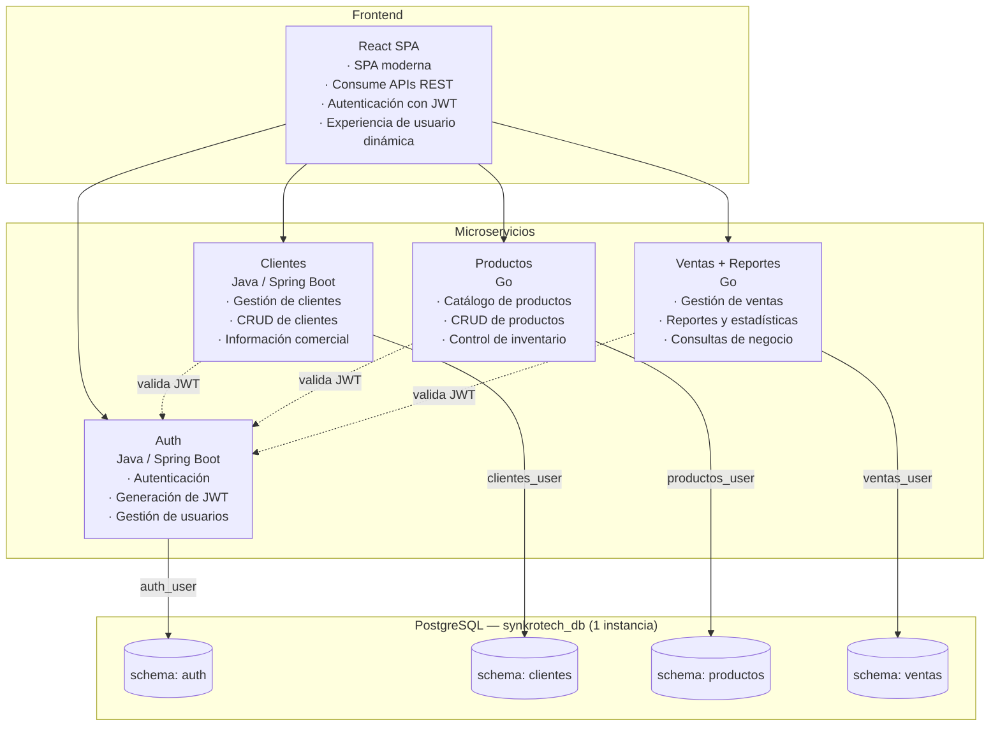

# ADR-001: Arquitectura del Sistema de Gestión de Ventas — SynkroTech SAS

**Estado:** Aceptado
**Fecha:** 2026-08

---

## Contexto

SynkroTech SAS necesita centralizar la gestión de clientes, productos, inventario y ventas, actualmente dispersa en herramientas manuales. El análisis de bounded contexts identificó 4 contextos de negocio con bajo acoplamiento entre sí: **Autenticación y Usuarios**, **Clientes**, **Productos e Inventario** y **Ventas** (este último incluye Reportes, por ser parte del mismo contexto de negocio).

El curso de Sistemas Distribuidos exige, como requisito, una arquitectura distribuida compuesta por:

- 4 repositorios de backend (Java y Go).
- 4 repositorios de frontend.
- 1 repositorio de base de datos, con una única base de datos lógica compartida por los 4 microservicios.
- 1 repositorio de documentación (docs), sin código — fuente de verdad de arquitectura, ADR y backlog.

---

## Decisión

### Estilo de arquitectura elegido

Microservicios independientes bajo arquitectura hexagonal (Puertos y Adaptadores), uno por cada bounded context identificado, comunicados vía REST/HTTP, con persistencia sobre una única base de datos física organizada en esquemas independientes por servicio.

### 1. Los 4 microservicios

| Servicio | Tecnología | Responsabilidad |
|---|---|---|
| Auth | Java (Spring Boot) | Registro/login de usuarios del sistema, emisión y validación de JWT, gestión de roles y permisos |
| Clientes | Java (Spring Boot) | Registro, actualización, búsqueda y desactivación de clientes de SynkroTech SAS |
| Productos | Go | Catálogo de productos, categorías y control de stock/inventario |
| Ventas | Go | Registro de ventas y su detalle, orquestación con Clientes y Productos, y generación de reportes (diarios, mensuales, top-productos) |

### 2. Base de datos: una sola instancia, un esquema por servicio

Se usa una única instancia física de PostgreSQL (un solo repositorio de base de datos), con un esquema (schema) independiente por microservicio:

```
Instancia PostgreSQL (1 sola)
└── Base de datos: synkrotech_db
    ├── schema: auth      → tablas: usuarios, refresh_tokens
    ├── schema: clientes  → tabla: clientes
    ├── schema: productos → tablas: productos, categorias
    └── schema: ventas    → tablas: ventas, detalle_venta, resumen_ventas
```

**Mecanismo de aislamiento** (esto es lo que hace que siga siendo "microservicios" y no un monolito de datos):

- Cada microservicio se conecta con un usuario de base de datos distinto (`auth_user`, `clientes_user`, `productos_user`, `ventas_user`), con permisos (`GRANT`) únicamente sobre su propio esquema. Ningún servicio tiene permisos de lectura/escritura sobre el esquema de otro.
- Cada servicio define su `search_path` al esquema propio, y gestiona sus propias migraciones (Flyway en Java, golang-migrate en Go) sin conocer las del resto.
- No hay llaves foráneas reales entre esquemas. Los campos `cliente_id` (en Ventas) y `producto_id` (en Ventas) no son FK — se validan mediante llamadas HTTP a los servicios de Clientes y Productos respectivamente, igual que si las bases fueran físicamente distintas.

### 3. Patrón arquitectónico interno (arquitectura hexagonal)

Cada microservicio se organiza en 3 capas:

- **Dominio:** entidades y reglas de negocio puras, sin dependencias de frameworks externos.
- **Aplicación (casos de uso):** orquesta la lógica de negocio y define puertos — interfaces que declaran lo que el dominio necesita o expone.
- **Infraestructura (adaptadores):**
  - Adaptadores de entrada: controladores REST.
  - Adaptadores de salida: repositorios (persistencia en el esquema propio de PostgreSQL) y clientes HTTP para consumir otros servicios.

### 4. Diagrama de arquitectura



> Nota: base de datos única con esquemas aislados por dominio, usuarios dedicados por servicio, mayor seguridad y organización.

### 5. Comunicación entre servicios

- **Ventas → Clientes:** validar existencia del cliente antes de crear una venta.
- **Ventas → Productos:** validar stock y precio, y actualizar stock tras la venta.
- **Clientes, Productos, Ventas → Auth:** validación local del JWT (verificación de firma con clave pública de Auth), sin llamada síncrona por cada solicitud.
- **Fase avanzada (opcional):** comunicación asíncrona vía eventos (RabbitMQ) para desacoplar aún más.

### 6. Auth, JWT y roles

Auth es el único servicio que emite tokens JWT (algoritmo RS256). Los demás solo los validan localmente con la clave pública.

**Flujo:** login → Auth valida credenciales → firma JWT con `sub`, `roles`, `permisos`, `iat`, `exp` → el frontend envía el token en `Authorization: Bearer <token>` en cada solicitud → cada servicio valida localmente → si expira, se usa el `refresh_token` contra Auth.

| Rol | Permisos |
|---|---|
| **ADMIN** | Acceso total: usuarios/roles, clientes, productos, ventas y reportes |
| **VENDEDOR** | Gestiona clientes, crea ventas, consulta stock, consulta reportes de sus propias ventas |
| **INVENTARIO** | Gestiona productos, categorías y stock; sin acceso a clientes, ventas ni reportes |

### 7. Modelo de datos por esquema

- **auth** — `usuarios` (usuario_id, nombre, correo, password_hash, rol, fecha_registro, activo), `refresh_tokens` (token_id, usuario_id FK, token, fecha_expiracion, activo).
- **clientes** — `clientes` (cliente_id, nombre, documento_identidad, correo, telefono, direccion, fecha_registro, activo).
- **productos** — `productos` (producto_id, nombre, precio, stock, categoria_id FK, activo), `categorias` (categoria_id, nombre, activo).
- **ventas** — `ventas` (venta_id, cliente_id ref. externa, fecha, total, activo), `detalle_venta` (detalle_id, venta_id FK, producto_id ref. externa, cantidad, precio_unitario, subtotal, activo), `resumen_ventas` (fecha, total_ventas_dia, total_ventas_mes, producto_id, cantidad_vendida, activo).

Todos los registros usan borrado lógico (`activo` booleano) en vez de eliminación física, para preservar trazabilidad.

### 8. APIs principales

| Servicio | Endpoint | Método | Descripción |
|---|---|---|---|
| Auth | `/api/auth/register` | POST | Registrar usuario del sistema |
| Auth | `/api/auth/login` | POST | Iniciar sesión y obtener JWT |
| Auth | `/api/auth/refresh` | POST | Renovar access token |
| Clientes | `/api/clientes` | POST | Registrar cliente |
| Clientes | `/api/clientes/{id}` | GET/PUT/DELETE | Consultar/actualizar/eliminar cliente |
| Productos | `/api/productos` | POST | Registrar producto |
| Productos | `/api/productos/{id}/stock` | PATCH | Actualizar stock |
| Ventas | `/api/ventas` | POST | Crear venta |
| Ventas | `/api/ventas/{id}` | GET | Consultar detalle de venta |
| Ventas | `/api/ventas/reportes/diario` \| `/mensual` \| `/top-productos` | GET | Reportes |

Todas las rutas, excepto `/api/auth/register` y `/api/auth/login`, requieren `Authorization: Bearer <token>`.

---

## Alternativas consideradas

**(a) 4 bases de datos físicamente independientes (una por microservicio)** — rechazado: no cumple el requisito del curso de una única base de datos lógica; además, para el volumen actual de SynkroTech SAS, mantener 4 instancias separadas añade complejidad operativa sin beneficio real.

**(b) 5 microservicios completos (Auth, Clientes, Productos, Ventas y Reportes como servicios independientes)** — rechazado: excede el límite de 4 repos backend; Reportes no es un bounded context distinto de Ventas (ver context-map), por lo que separarlo violaría el principio de que cada servicio representa un contexto de negocio real, no una división arbitraria.

**(c) Monolito modular** — rechazado: no satisface el objetivo pedagógico del curso (comunicación entre servicios distribuidos, múltiples lenguajes, múltiples repos).

**(d) Auth embebido dentro de Clientes (sin servicio propio)** — rechazado: mezcla dos bounded contexts distintos (usuarios internos del sistema vs. clientes compradores), complicando la gestión de roles/permisos.

---

## Consecuencias

### Positivas

- Separación clara de responsabilidades por bounded context, respaldada por un análisis de dominio (no solo por la restricción de repos).
- Cumple el requisito de una única base de datos lógica sin sacrificar la independencia real de datos entre servicios.
- Balance de 2 servicios en Java / 2 en Go, cumpliendo el requisito del curso.
- Auth centralizado simplifica la gestión de roles y seguridad.

### Negativas

- El aislamiento entre esquemas depende de la correcta configuración de permisos de base de datos (`GRANT`); un error de configuración podría romper el aislamiento sin que se note de inmediato.
- Ventas concentra más responsabilidad de la ideal (orquesta Clientes, Productos, y genera reportes).
- La comunicación síncrona entre servicios introduce acoplamiento temporal (si Productos cae, Ventas no puede crear ventas).
- No hay transacciones ACID entre servicios; se requiere manejo explícito de consistencia eventual.
- Al compartir una sola instancia física de PostgreSQL, un problema de rendimiento o caída de esa instancia afecta a los 4 microservicios simultáneamente (punto único de falla a nivel de infraestructura, aunque los datos permanezcan lógicamente aislados).

---

## Regla de inmutabilidad

Este ADR, una vez aceptado, no se modifica. Cualquier cambio a esta decisión de arquitectura debe documentarse en un nuevo archivo (`adr-002-*.md`) que referencie explícitamente a ADR-001 como el registro que reemplaza, indicando qué cambió y por qué.
