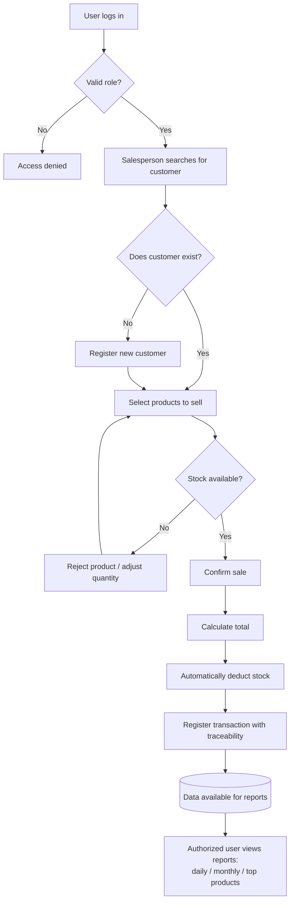

# PDR, Preliminary Design Review Document

## Sales Management System, SynkroTech SAS

**Version:** 1.0

**Date:** August 2026

**Subject:** Distributed Systems

**Document type:** Preliminary, for review and approval

---

## Team Members

| Full Name                          | GitHub User                                                                    |
| ---------------------------------- | ------------------------------------------------------------------------------ |
| Sergio Andres Ordoñez Diaz         | [https://github.com/SergioAndres17](https://github.com/SergioAndres17)         |
| Fredman Santiago Plazas Artunduaga | [https://github.com/SantiagoPlazas2005](https://github.com/SantiagoPlazas2005) |
| Jordan Ramirez Gallego             | [https://github.com/JordanRG420](https://github.com/JordanRG420)               |
| Angel Gustavo Solano Trujillo      | [https://github.com/AsolanoT](https://github.com/AsolanoT)                     |

---

## 00, Initial Context

**SynkroTech SAS** is a medium-sized company dedicated to the commercialization of technology products and electronic accessories, including computers, laptops, peripherals, components, storage devices, and connectivity equipment.

Due to sales growth and the increasing number of products in its catalog, the company needs a solution that allows it to centrally manage customer, product, inventory, and commercial transaction information.

Currently, sales and inventory control are managed through scattered tools and manual processes, such as spreadsheets, physical records, and isolated systems. This makes it difficult to accurately determine product availability, customer purchase history, and sales performance.

---

## 01, Needs and Problems

### 1.1 Central Need

Have a system that centralizes customers, products, and sales, automates calculations and stock control, maintains transaction traceability, and provides useful reports for the commercial and administrative management of SynkroTech SAS, all under a secure access model.

### 1.2 Identified Problems

* Difficulty determining real-time product availability in inventory.
* Lack of traceability of each customer's purchase history.
* Manual calculations that are prone to errors when recording sales.
* Lack of consolidated reports to support business decisions, such as daily sales, monthly sales, and best-selling products.
* Information scattered across non-integrated tools, without a single source of truth.

### 1.3 Functional Requirements

| ID    | Requirement                                                                                                   |
| ----- | ------------------------------------------------------------------------------------------------------------- |
| RF-01 | The system must allow users to register, update, view, and deactivate customers.                              |
| RF-02 | The system must allow users to register, update, view, and deactivate products.                               |
| RF-03 | The system must allow products to be organized by category.                                                   |
| RF-04 | The system must control the available stock of each product.                                                  |
| RF-05 | The system must allow users to register a sale by associating a customer with one or more products.           |
| RF-06 | The system must automatically calculate the total amount of a sale based on the product details.              |
| RF-07 | The system must automatically deduct stock when a sale is registered.                                         |
| RF-08 | The system must generate daily and monthly sales reports.                                                     |
| RF-09 | The system must generate a report of the best-selling products.                                               |
| RF-10 | The system must authenticate users and restrict operations according to their role (ADMIN, SALES, INVENTORY). |

### 1.4 Non-Functional Requirements

| ID     | Requirement                                                                                                                                          |
| ------ | ---------------------------------------------------------------------------------------------------------------------------------------------------- |
| RNF-01 | The system must be available through a web interface accessible from a browser.                                                                      |
| RNF-02 | Operations involving business data must require authentication using JWT.                                                                            |
| RNF-03 | The system must allow each business component, customers, products, sales, and authentication, to evolve independently.                              |
| RNF-04 | The system must maintain operation traceability. Records must not be physically deleted; instead, they must be deactivated.                          |
| RNF-05 | The system must respond to critical operations, such as registering a sale and checking stock, within reasonable time frames for daily business use. |
| RNF-06 | The system must be prepared to grow in catalog and transaction volume without requiring a major redesign.                                            |
| RNF-07 | The system must interoperate between its components through standard interfaces (REST API).                                                          |

---

## 02, Current Processes / Expected Flow

### Current Process, Manual

1. A salesperson assists the customer and manually checks product availability, either through a physical inspection or an outdated spreadsheet.
2. The sale is recorded in a notebook or isolated file, without any connection to the inventory.
3. Stock is not updated automatically. It is corrected manually, sometimes days later.
4. There is no consolidated report. To determine how much was sold during a given period, someone must manually review and add information from different sources.

### Expected Flow, With the System

1. The system user, salesperson, inventory employee, or administrator, logs in and the system validates their role.
2. The salesperson searches for the customer, or registers the customer if they are new, and selects the products to be sold.
3. The system validates stock availability in real time before confirming the sale.
4. Once the sale is confirmed, the system calculates the total, automatically deducts the stock, and records the transaction with complete traceability.
5. At any time, an authorized user can view daily sales, monthly sales, or best-selling product reports generated from real and up-to-date data.

### First Version Scope, MVP

**Included:**

* Management of customers, products, categories, and stock.
* Sales registration with automatic calculation and inventory deduction.
* Daily, monthly, and best-selling product reports.
* Role-based authentication and authorization (ADMIN, SALES, INVENTORY).

**Out of Scope, For Now:**

* Multiple branches or warehouses. A single operational location for SynkroTech SAS is assumed.
* Self-service portal for end customers. The system is for internal use.
* Electronic invoicing with tax authorities.
* Integration with payment gateways.
* Returns and warranties. These may be added in a later version.

---

## 03, Open Questions

| # | Question                                                                                                                                                       | Impact if Unresolved                                                                        | Status                                                                                               |
| - | -------------------------------------------------------------------------------------------------------------------------------------------------------------- | ------------------------------------------------------------------------------------------- | ---------------------------------------------------------------------------------------------------- |
| 1 | Will SynkroTech SAS manage discounts or promotions on products in the MVP?                                                                                     | Affects the calculation of totals in Sales                                                  | Pending business validation                                                                          |
| 2 | Is it necessary to support multiple payment methods, such as cash, card, and bank transfer, from the MVP, or is it sufficient to record the total sale amount? | Affects the `sales` data model                                                              | Pending business validation                                                                          |
| 3 | What happens if the stock of a product reaches zero during the sales process, immediately before confirmation?                                                 | Affects the concurrency design of the Products service                                      | Pending technical definition                                                                         |
| 4 | Does the INVENTORY role need access to sales reports, or is its scope strictly limited to products and stock?                                                  | Affects permissions defined in Auth                                                         | Resolved, see the roles section in `adr/adr-001-architecture.md`, with no access to sales or reports |
| 5 | Will there be more than one branch or warehouse in the near future, next semester, but not in this MVP?                                                        | Affects whether the data model should be designed for multiple locations from the beginning | Pending business validation                                                                          |

---

## 04, Business Glossary

| Term                             | Definition                                                                                                                                                           |
| -------------------------------- | -------------------------------------------------------------------------------------------------------------------------------------------------------------------- |
| **Customer**                     | An individual or legal entity that purchases products from SynkroTech SAS.                                                                                           |
| **Product**                      | A technology product or electronic accessory commercialized by SynkroTech SAS, such as computers, peripherals, components, and others.                               |
| **Category**                     | A grouping of products with similar commercial characteristics, for example, "Laptops" or "Peripherals".                                                             |
| **Stock**                        | The quantity of a product currently available in SynkroTech SAS's inventory.                                                                                         |
| **Sale**                         | A commercial transaction in which a customer purchases one or more products.                                                                                         |
| **Sale Detail**                  | Each product line associated with a sale, including product, quantity, and unit price.                                                                               |
| **Traceability**                 | The ability to track the complete history of an operation, including who performed it, when it occurred, and what was done.                                          |
| **Sales Report**                 | Aggregated information about sales made during a specific period, such as a day or month, or information about the best-selling products.                            |
| **System User**                  | An employee of SynkroTech SAS, such as an administrator, salesperson, or inventory employee, who logs in to operate the system. This is different from a "customer". |
| **Role**                         | A category assigned to a system user, such as ADMIN, SALES, or INVENTORY, that determines which operations the user is allowed to perform.                           |
| **MVP (Minimum Viable Product)** | The first functional version of the system, with the minimum scope necessary to provide value to the business.                                                       |
