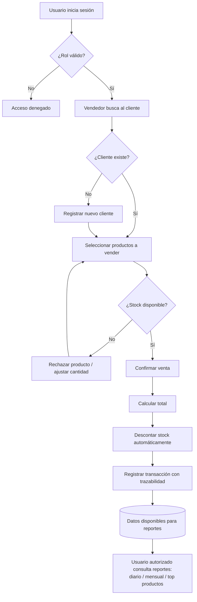

# PDR — Documento de Revisión de Diseño Preliminar
## Sistema de Gestión de Ventas — SynkroTech SAS

**Versión:** 1.0

**Fecha:** Agosto 2026

**Materia:** Sistemas Distribuidos 

**Tipo de documento:** Preliminary — for review and approval 

---

## Team Members

| Full Name | GitHub User |
|------------|------------|
| Sergio Andres Ordoñez Diaz | https://github.com/SergioAndres17 |
| Fredman Santiago Plazas Artunduaga | https://github.com/SantiagoPlazas2005 |
| Jordan Ramirez Gallego | https://github.com/JordanRG420 |
| Angel Gustavo Solano Trujillo | https://github.com/AsolanoT |

---

## 00 — Contexto inicial

**SynkroTech SAS** es una empresa mediana dedicada a la comercialización de productos tecnológicos y accesorios electrónicos: computadores, portátiles, periféricos, componentes, dispositivos de almacenamiento y equipos de conectividad.

Debido al crecimiento de las ventas y al aumento de referencias en su catálogo, la empresa necesita una solución que le permita administrar de manera centralizada la información de clientes, productos, inventario y transacciones comerciales.

Actualmente, el control de ventas y existencias se realiza mediante herramientas dispersas y procesos manuales (hojas de cálculo, registros físicos, sistemas aislados), lo que dificulta conocer con precisión la disponibilidad de productos, el historial de compras de los clientes y el rendimiento de las ventas.

---

## 01 — Necesidades y problemas

### 1.1 Necesidad central

Contar con un sistema que centralice clientes, productos y ventas, automatice cálculos y control de stock, mantenga trazabilidad de las transacciones y provea reportes útiles para la gestión comercial y administrativa de SynkroTech SAS, todo bajo un esquema de acceso seguro.

### 1.2 Problemas identificados

- Dificultad para conocer en tiempo real la disponibilidad de productos en inventario.
- Falta de trazabilidad del historial de compras por cliente.
- Cálculos manuales propensos a error en el registro de ventas.
- Ausencia de reportes consolidados que apoyen decisiones comerciales (ventas por día, por mes, productos más vendidos).
- Información dispersa entre herramientas no integradas, sin una única fuente de verdad.

### 1.3 Requerimientos funcionales

| ID | Requerimiento |
|---|---|
| RF-01 | El sistema debe permitir registrar, actualizar, consultar y desactivar clientes. |
| RF-02 | El sistema debe permitir registrar, actualizar, consultar y desactivar productos. |
| RF-03 | El sistema debe permitir organizar los productos por categorías. |
| RF-04 | El sistema debe controlar el stock disponible de cada producto. |
| RF-05 | El sistema debe permitir registrar una venta asociando cliente y uno o más productos. |
| RF-06 | El sistema debe calcular automáticamente el total de una venta a partir del detalle de productos. |
| RF-07 | El sistema debe descontar el stock automáticamente al registrar una venta. |
| RF-08 | El sistema debe generar reportes de ventas diarios y mensuales. |
| RF-09 | El sistema debe generar un reporte de productos más vendidos. |
| RF-10 | El sistema debe autenticar usuarios y restringir operaciones según su rol (ADMIN, VENDEDOR, INVENTARIO). |

### 1.4 Requerimientos no funcionales

| ID | Requerimiento |
|---|---|
| RNF-01 | El sistema debe estar disponible mediante una interfaz web accesible desde navegador. |
| RNF-02 | Las operaciones sobre datos empresariales deben requerir autenticación mediante JWT. |
| RNF-03 | El sistema debe permitir que cada componente de negocio (clientes, productos, ventas, autenticación) evolucione de forma independiente. |
| RNF-04 | El sistema debe mantener trazabilidad de las operaciones (no se eliminan registros físicamente, se desactivan). |
| RNF-05 | El sistema debe responder a las operaciones críticas (registrar venta, consultar stock) en tiempos razonables para uso comercial diario. |
| RNF-06 | El sistema debe estar preparado para crecer en volumen de catálogo y transacciones sin rediseño mayor. |
| RNF-07 | El sistema debe interoperar entre sus componentes mediante interfaces estándar (API REST). |

---

## 02 — Procesos actuales / Flujo esperado

### Proceso actual (manual)

1. Un vendedor recibe al cliente y consulta la disponibilidad de un producto de forma manual (revisión física o en una hoja de cálculo desactualizada).
2. Se registra la venta en un cuaderno o archivo aislado, sin conexión con el inventario.
3. El stock no se actualiza automáticamente; se corrige manualmente, a veces días después.
4. No existe un reporte consolidado; para saber cuánto se vendió en un periodo, alguien debe revisar y sumar manualmente distintas fuentes.

### Flujo esperado (con el sistema)

1. El usuario del sistema (vendedor, inventario o admin) inicia sesión y el sistema valida su rol.
2. El vendedor busca al cliente (o lo registra si es nuevo) y selecciona los productos a vender.
3. El sistema valida en tiempo real la disponibilidad de stock antes de confirmar la venta.
4. Al confirmar, el sistema calcula el total, descuenta el stock automáticamente y registra la transacción con trazabilidad completa.
5. En cualquier momento, un usuario autorizado puede consultar reportes de ventas diarios, mensuales o de productos más vendidos, generados a partir de datos reales y actualizados.

### Alcance de la primera versión (MVP)

**Incluido:**
- Gestión de clientes, productos, categorías y stock.
- Registro de ventas con cálculo automático y descuento de inventario.
- Reportes diarios, mensuales y de productos más vendidos.
- Autenticación y autorización basada en roles (ADMIN, VENDEDOR, INVENTARIO).

**Fuera de alcance (por ahora):**
- Múltiples sucursales o bodegas (se asume una sola sede operativa de SynkroTech SAS).
- Portal de autoservicio para clientes finales (el sistema es de uso interno).
- Facturación electrónica ante entidades fiscales.
- Integración con pasarelas de pago.
- Devoluciones y garantías (podrían añadirse en una versión posterior).

---

## 03 — Preguntas abiertas

| # | Pregunta | Impacto si no se resuelve | Estado |
|---|---|---|---|
| 1 | ¿SynkroTech SAS manejará descuentos o promociones sobre productos en el MVP? | Afecta el cálculo de totales en Ventas | Pendiente de validar con el negocio |
| 2 | ¿Se requiere manejar múltiples métodos de pago (efectivo, tarjeta, transferencia) desde el MVP, o basta con registrar el total de la venta? | Afecta el modelo de datos de `ventas` | Pendiente de validar con el negocio |
| 3 | ¿Qué pasa si el stock de un producto llega a cero durante el proceso de venta (justo antes de confirmar)? | Afecta el diseño de concurrencia del servicio de Productos | Pendiente de definición técnica |
| 4 | ¿El rol INVENTARIO necesita ver reportes de ventas, o su alcance es estrictamente productos/stock? | Afecta permisos definidos en Auth | Resuelto — ver sección de roles en `adr/adr-001-architecture.md` (sin acceso a ventas ni reportes) |
| 5 | ¿Habrá más de una sede/bodega en el futuro cercano (siguiente semestre, no en este MVP)? | Afecta si vale la pena diseñar el modelo de datos pensando en multi-sede desde ya | Pendiente de validar con el negocio |

---

## 04 — Glosario de negocio

| Término | Definición |
|---|---|
| **Cliente** | Persona natural o jurídica que compra productos a SynkroTech SAS. |
| **Producto** | Artículo tecnológico o accesorio electrónico comercializado por SynkroTech SAS (computadores, periféricos, componentes, etc.). |
| **Categoría** | Agrupación de productos con características comerciales similares (ej. "Portátiles", "Periféricos"). |
| **Stock** | Cantidad disponible de un producto en el inventario de SynkroTech SAS. |
| **Venta** | Transacción comercial en la que un cliente adquiere uno o más productos. |
| **Detalle de venta** | Cada línea de producto asociada a una venta (producto, cantidad, precio unitario). |
| **Trazabilidad** | Capacidad de rastrear el historial completo de una operación (quién, cuándo, qué se hizo). |
| **Reporte de ventas** | Información agregada sobre las ventas realizadas en un periodo (día, mes) o sobre los productos más vendidos. |
| **Usuario del sistema** | Empleado de SynkroTech SAS (administrador, vendedor o personal de inventario) que inicia sesión para operar el sistema. Distinto de "cliente". |
| **Rol** | Categoría asignada a un usuario del sistema (ADMIN, VENDEDOR, INVENTARIO) que determina qué operaciones puede realizar. |
| **MVP (Minimum Viable Product)** | Primera versión funcional del sistema, con el alcance mínimo necesario para ser útil al negocio. |
