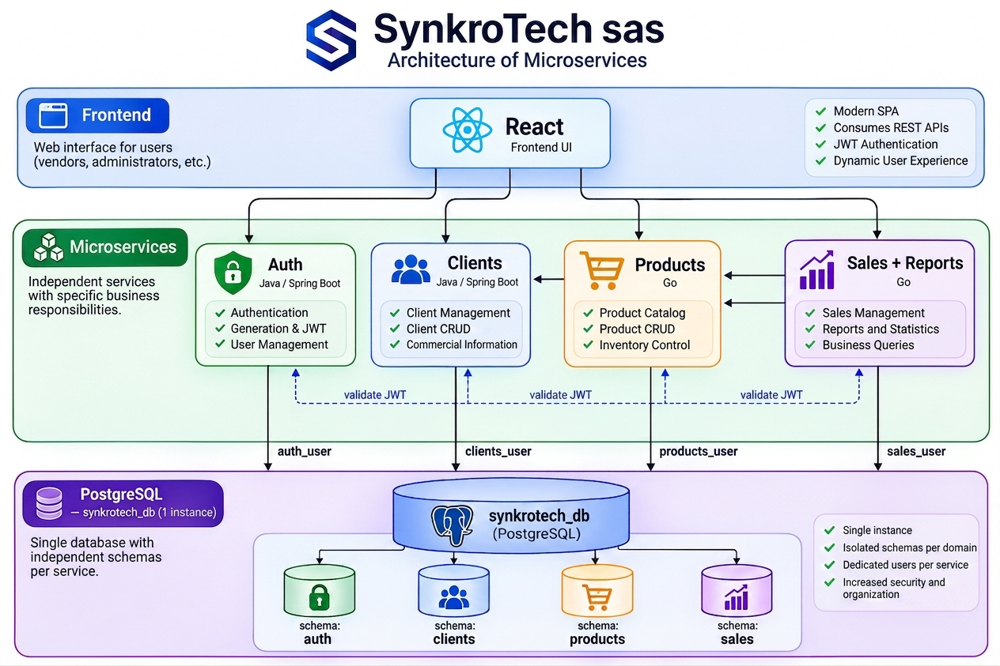

# ADR-001: Sales Management System Architecture, SynkroTech SAS

**Status:** Accepted

**Date:** 2026-08

---

## Context

SynkroTech SAS needs to centralize the management of customers, products, inventory, and sales, which are currently scattered across manual tools. The bounded context analysis identified 4 business contexts with low coupling between them: **Authentication and Users**, **Customers**, **Products and Inventory**, and **Sales**. The latter includes Reports because they are part of the same business context.

The Distributed Systems course requires, as an architectural requirement, a distributed architecture composed of:

* 4 backend repositories, using Java and Go.
* 4 frontend repositories.
* **1 database repository**, with a single logical database shared by the 4 microservices.
* 1 documentation repository (`docs`), with no code, serving as the source of truth for architecture, ADRs, and backlog.

---

## Decision

### Selected Architecture Style

**Independent microservices using Hexagonal Architecture (Ports and Adapters)**, one for each identified bounded context, communicating through REST/HTTP, with persistence on **a single physical database** organized into independent schemas per service.

### 1. The 4 Microservices

| Service       | Technology         | Responsibility                                                                                                                                           |
| ------------- | ------------------ | -------------------------------------------------------------------------------------------------------------------------------------------------------- |
| **Auth**      | Java (Spring Boot) | System user registration/login, JWT issuance and validation, role and permission management                                                              |
| **Customers** | Java (Spring Boot) | Registration, updating, searching, and deactivation of SynkroTech SAS customers                                                                          |
| **Products**  | Go                 | Product catalog, categories, and stock/inventory management                                                                                              |
| **Sales**     | Go                 | Sales and sales detail registration, orchestration with Customers and Products, and report generation, including daily, monthly, and top-product reports |

### 2. Database: One Instance, One Schema per Service

The system uses **a single physical PostgreSQL instance** as the only database repository, with **one independent schema per microservice**:

```text
PostgreSQL Instance (1 physical instance)

└── Database: synkrotech_db

    ├── schema: auth        → tables: users, refresh_tokens

    ├── schema: customers   → table: customers

    ├── schema: products    → tables: products, categories

    └── schema: sales       → tables: sales, sale_details, sales_summary
```

**Isolation mechanism, which ensures that this remains a microservices architecture rather than a data monolith:**

* Each microservice connects using a **different database user** (`auth_user`, `customers_user`, `products_user`, `sales_user`), with `GRANT` permissions restricted exclusively to its own schema. No service has read or write permissions on another service's schema.

* Each service defines its `search_path` to its own schema and manages its own migrations, using Flyway for Java and `golang-migrate` for Go, without depending on the migrations of the other services.

* **There are no actual foreign keys between schemas.** The `customer_id` field in Sales and the `product_id` field in Sales are not foreign keys. They are validated through HTTP calls to the Customers and Products services respectively, just as they would be if the databases were physically separate.

### 3. Internal Architectural Pattern, Hexagonal Architecture

Each microservice is organized into 3 layers:

* **Domain:** pure business entities and business rules, with no dependencies on external frameworks.

* **Application, use cases:** orchestrates business logic and defines **ports**, which are interfaces declaring what the domain needs or exposes.

* **Infrastructure, adapters:**

  * **Inbound adapters:** REST controllers.
  * **Outbound adapters:** repositories, responsible for persistence in the service's own PostgreSQL schema, and HTTP clients used to communicate with other services.

### 4. Architecture Diagram



### 5. Communication Between Services

* **Sales → Customers:** validates that the customer exists before creating a sale.

* **Sales → Products:** validates stock and price and updates stock after the sale.

* **Customers, Products, Sales → Auth:** locally validate the JWT by verifying its signature using Auth's public key, without making a synchronous request to Auth for every request.

* **Advanced phase, optional:** asynchronous communication through events using RabbitMQ to further decouple the services.

### 6. Auth, JWT, and Roles

Auth is the only service responsible for issuing JWT tokens, using the RS256 algorithm. The other services only validate the tokens locally using Auth's public key.

**Flow:** login → Auth validates credentials → signs JWT containing `sub`, `roles`, `permissions`, `iat`, and `exp` → the frontend sends the token through `Authorization: Bearer <token>` with each request → each service validates the token locally → when the access token expires, the `refresh_token` is sent to Auth.

| Role          | Permissions                                                                           |
| ------------- | ------------------------------------------------------------------------------------- |
| **ADMIN**     | Full access: users/roles, customers, products, sales, and reports                     |
| **SALES**     | Manages customers, creates sales, checks stock, and views reports for their own sales |
| **INVENTORY** | Manages products, categories, and stock; no access to customers, sales, or reports    |

### 7. Data Model per Schema

**`auth`**: `users` (`user_id`, `name`, `email`, `password_hash`, `role`, `registration_date`, `active`), `refresh_tokens` (`token_id`, `user_id` FK, `token`, `expiration_date`, `active`).

**`customers`**: `customers` (`customer_id`, `name`, `identity_document`, `email`, `phone`, `address`, `registration_date`, `active`).

**`products`**: `products` (`product_id`, `name`, `price`, `stock`, `category_id` FK, `active`), `categories` (`category_id`, `name`, `active`).

**`sales`**: `sales` (`sale_id`, `customer_id` external reference, `date`, `total`, `active`), `sale_details` (`detail_id`, `sale_id` FK, `product_id` external reference, `quantity`, `unit_price`, `subtotal`, `active`), `sales_summary` (`date`, `daily_sales_total`, `monthly_sales_total`, `product_id`, `quantity_sold`, `active`).

All records use **soft deletion** through the `active` boolean field instead of physical deletion, in order to preserve traceability.

### 8. Main APIs

| Service   | Endpoint                                                  | Method         | Description                       |
| --------- | --------------------------------------------------------- | -------------- | --------------------------------- |
| Auth      | `/api/auth/register`                                      | POST           | Register a system user            |
| Auth      | `/api/auth/login`                                         | POST           | Log in and obtain a JWT           |
| Auth      | `/api/auth/refresh`                                       | POST           | Refresh the access token          |
| Customers | `/api/customers`                                          | POST           | Register a customer               |
| Customers | `/api/customers/{id}`                                     | GET/PUT/DELETE | Retrieve/update/delete a customer |
| Products  | `/api/products`                                           | POST           | Register a product                |
| Products  | `/api/products/{id}/stock`                                | PATCH          | Update stock                      |
| Sales     | `/api/sales`                                              | POST           | Create a sale                     |
| Sales     | `/api/sales/{id}`                                         | GET            | Retrieve sale details             |
| Sales     | `/api/sales/reports/daily` / `/monthly` / `/top-products` | GET            | Reports                           |

All routes, except `/api/auth/register` and `/api/auth/login`, require `Authorization: Bearer <token>`.

---

## Alternatives Considered

**(a) 4 physically independent databases, one per microservice:** rejected because it does not comply with the course requirement of a single logical database. Additionally, for SynkroTech SAS's current volume, maintaining 4 separate database instances introduces operational complexity without providing a significant real benefit.

**(b) 5 complete microservices, Auth, Customers, Products, Sales, and Reports as independent services:** rejected because it exceeds the limit of 4 backend repositories. Reports is not a separate bounded context from Sales, as established in the context map. Therefore, separating it would violate the principle that each service should represent a real business context rather than an arbitrary technical division.

**(c) Modular monolith:** rejected because it does not satisfy the course's educational objective, which includes communication between distributed services, multiple programming languages, and multiple repositories.

**(d) Embedded Auth inside Customers, without a dedicated service:** rejected because it mixes two distinct bounded contexts, internal system users and purchasing customers, making role and permission management more difficult.

---

## Consequences

### Positive

* Clear separation of responsibilities by bounded context, supported by domain analysis rather than simply by the repository constraint.

* Complies with the requirement for a single logical database without sacrificing actual data independence between services.

* Balanced distribution of 2 services in Java and 2 in Go, complying with the course requirements.

* Centralized Auth simplifies role and security management.

### Negative

* Isolation between schemas depends on the correct configuration of database permissions through `GRANT`. A configuration error could break the intended isolation without being immediately detected.

* Sales concentrates more responsibility than ideal because it orchestrates Customers and Products and also generates reports.

* Synchronous communication between services introduces temporal coupling. If Products is unavailable, Sales cannot create sales.

* There are no ACID transactions across services. Explicit handling of eventual consistency is therefore required.

* Because all 4 microservices share a single physical PostgreSQL instance, a performance problem or outage affecting that instance will affect all 4 microservices simultaneously. This represents a single point of failure at the infrastructure level, even though the data remains logically isolated.

---

## Immutability Rule

Once this ADR has been accepted, **it must not be modified**.

Any change to this architectural decision must be documented in a new file, such as `adr-002-*.md`, which must explicitly reference ADR-001 as the decision being replaced. The new ADR must indicate **what changed and why**.
